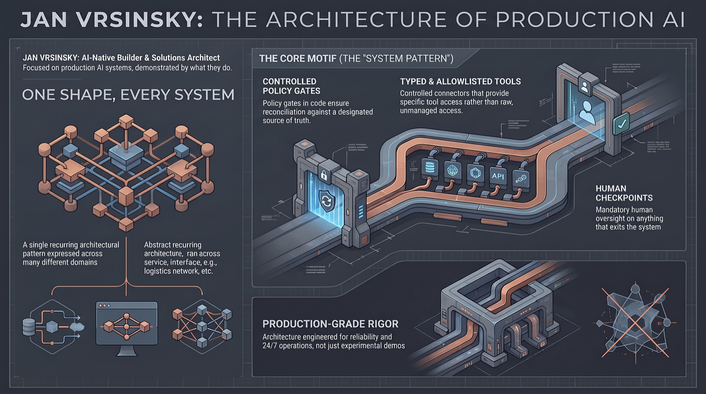

# Jan Vrsinsky

**Production AI systems, shown by what they do.** Each one has its own repo below, with the design, runnable code, and clips of the real thing. What is public is sanitized on purpose: the real systems handle real money and private data, so you see the architecture, runnable samples, and live clips, never the private internals.

               
            
      
        
   
       
   
      

## Systems

**[Concierge](https://github.com/janvrsinsky/jv-support-agent)** &nbsp;·&nbsp; 🟢 Production  
Drafts grounded replies to customer emails over typed MCP tools, into Gmail Drafts behind a policy gate and human review. Never auto-sends; prompt-injection attempts are quarantined.

**[Quant Watchtower](https://github.com/janvrsinsky/jv-watchtower-mcp)** &nbsp;·&nbsp; 🟢 Production  
Read-only MCP operations console over a live 24/7 algorithmic trading fleet. Sanitization is enforced in the data layer, so the strategy never reaches the model.

**[Cortex](https://github.com/janvrsinsky/jv-cortex-platform)** &nbsp;·&nbsp; 🟢 Production  
Self-hosted knowledge-AI platform: an Obsidian vault wired for AI agents through an MCP layer, Docker sync, and Python tooling. Ships a runnable clean-room linter.

**[Dev System](https://github.com/janvrsinsky/jv-dev-system)** &nbsp;·&nbsp; ⚙️ Method  
The method behind all of these: bounded efforts, standing invariants, a per-change audit trail, acceptance discipline. Validated on a live production system for two-plus months.

**[Celestia](https://github.com/janvrsinsky/jv-obsidian-assistant)** &nbsp;·&nbsp; 🟢 In daily production  
Persona-driven assistant over a private Obsidian vault through a typed MCP filesystem core. Reads before it answers; every write routes to its owning note.

**[Ledger](https://github.com/janvrsinsky/jv-ledger-agent)** &nbsp;·&nbsp; 🟢 Mirrors production  
Accounting-ops agent that closes the books over typed MCP tools. Auto-books only what a deterministic policy gate proves safe, routes the rest to a human, prints a full audit trail.

**[The Librarian](https://github.com/janvrsinsky/jv-podcast-rag)** &nbsp;·&nbsp; 🔵 Lab  
Agentic RAG over a podcast archive: hybrid BM25 + dense retrieval (RRF), answers cited to the minute, scored against a hand-labeled gold set (recall@k, MRR).

## One shape, every system

Different domains, one architecture: agents get typed, allowlisted tools instead of raw access; a policy gate lives in code, not in a prompt; state changes are reconciled against a source of truth; and anything that leaves the system passes a human. Building the same shape over many kinds of data is the point. The pattern and the discipline behind it are documented in [Dev System](https://github.com/janvrsinsky/jv-dev-system).

## Contact

[LinkedIn](https://linkedin.com/in/janvrsinsky) · [github.com/janvrsinsky](https://github.com/janvrsinsky)
